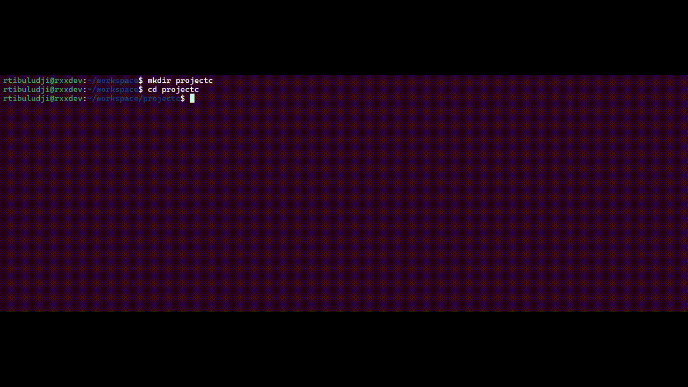

# rtcmake_init

A simple and efficient tool for generating the necessary file structure and configurations for a CMake-based C/C++ project. It helps streamline the process of setting up new projects, reducing boilerplate and ensuring consistency across different projects.



## Features

- Automatically generates a standard folder structure for CMake projects.
- Supports both C and C++ project types.
- Easy-to-use CLI for project initialization.
- Customizable templates for CMakeLists.txt, source files, and header files.
- Ensures consistency in project setup.

## Getting Started

### Prerequisites

Before using `rtcmake_init`, ensure you have the following installed:

- CMake (version 3.30 or higher)
- C/C++ compiler

### Installation

You can install `rtcmake_init` by following these steps:

```bash
# Clone the repository
git clone https://github.com/rtibuludji/rtcmake_init.git

# Navigate into the directory
cd rtcmake_init
 
# Install the tool
cmake --preset release
cmake --build --preset release --target install

```

## Motivation
Back to Basics with Modern Tooling

Early in my journey as a software engineer, back when the internet wasn’t as accessible as it is today, I often had to create my own tools to streamline my workflow (driven by a bit of laziness!). I transitioned from C/C++/ASM to domain-specific languages like COBOL and RPG/LE, yet I still held on to my habit of building custom tools.

Now, after many years, with modern tooling available, I’ve decided to return to the basics and enhance my C/C++ skills using today's technology. Inspired by [cmake_init](https://github.com/friendlyanon/cmake-init), I’ve started a new project similar to cmake_init called rtcmake_init—a lightweight tool, written purely in C, with minimal dependencies.